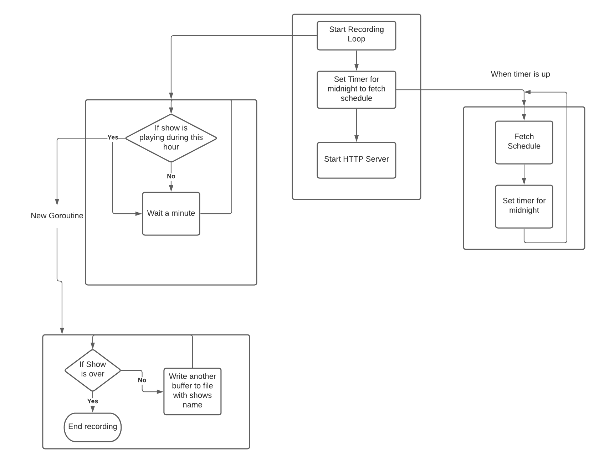

# Depreciation
Note: this system has been depreciated in favor of the new vortex webserver and a backend recorder.

# StreamRecorder

An internally built stream recorder for logging past shows

## Design

Basic design is to create 2 goroutines. One that fetches the spinitron scehdule every night at midnight, and another to check if there is a show that is suppose to be recording, and if true, start another routine to record the show to the storage directory

The design also includes an HTTP server to checking the health of the application by being able to monitor the schedule and currently recording show



## Features
- Send errors to Slack channel for feedback to staff
- HTTP Endpoints to check health of application

## Running 
```shell
go run main.go
```

### Learning Go
Here are some places to learn Go
- [The Go Tour](https://tour.golang.org/welcome/1): Great intro to learning Go if coming from another language
- [Getting Started with Go](https://go.dev/learn/): Go Developers blog on where to get started with Go
- [LearnGoInYMinutes](https://learnxinyminutes.com/docs/go/): Great site to quickly check syntax for Go 
- [The Go Playground](https://play.golang.org/p/MAohLsrz7JQ): Online Go compiler for quickly testing syntax
- [Go by Example](https://gobyexample.com/): Great place to quickly check examples of how to perform common programming tasks in Go with examples
